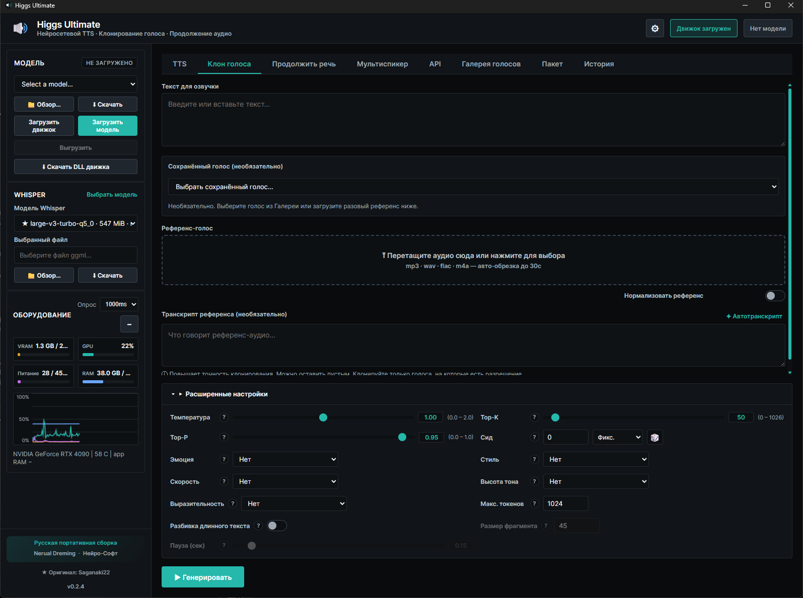
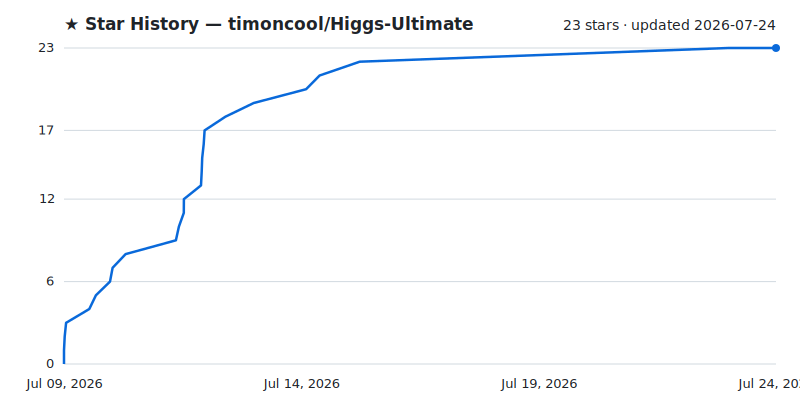

<div align="center">

# Higgs Ultimate

**Портативная нейросеть для синтеза и клонирования речи на Windows — на нативном движке Higgs Audio v3, полностью офлайн, с русским интерфейсом.**

[](LICENSE)
[](https://github.com/timoncool/Higgs-Ultimate/stargazers)
[](https://github.com/timoncool/Higgs-Ultimate/commits)
[](https://github.com/timoncool/Higgs-Ultimate/releases)



</div>

## Что это

**Higgs Ultimate** — русская портативная сборка нейросети синтеза речи на движке [Higgs Audio v3](https://huggingface.co/bosonai). Озвучивает текст, клонирует голос по короткому референсу, продолжает речь и собирает многоголосые диалоги — **100% локально, без интернета, облака и подписок**. Нативный C++/CUDA-движок (GGUF) — быстрый старт и низкое потребление VRAM, без тяжёлого Python-окружения.

В отличие от оригинала — **полностью портативная**: всё (модели, голоса, движок, настройки) лежит рядом с `.exe`. Удалил папку — не осталось ни следа в системе. Плюс русский интерфейс, батч-режим, регулятор громкости и стартовый пак голосов.

## Возможности

- **Синтез речи (TTS)** — нативный движок Higgs Audio v3, кванты от Q4 (8 ГБ VRAM) до BF16 (16 ГБ)
- **Клонирование голоса** — по референс-аудио 30 сек, с авто-транскриптом через Whisper
- **Продолжение речи** — модель договаривает начатую фразу в том же голосе
- **Мультиспикер** — многоголосые диалоги с назначением голоса на реплику
- **Галерея голосов** — сохранение голосов-персон, импорт/экспорт, фото и заметки
- **Стартовый войспак** — пак голосов Nerual Dreming в один клик
- **Пакетный режим** — отдельная вкладка: генерация пачки клипов из списка строк или `.txt` файлов
- **Локальный API** — HTTP-сервер с потоковым NDJSON для интеграций
- **Полностью портативная** — ничего не пишется в профиль пользователя
- **Русский и английский интерфейс** — переключение на лету

## Системные требования

- **ОС:** Windows 10 / 11 (x64)
- **GPU:** NVIDIA с 8–16 ГБ VRAM (в зависимости от кванта модели)
- **WebView2** — предустановлен в Windows 11 (в Windows 10 ставится автоматически)
- **Место:** ~6 ГБ на модель (Q8_0)

## Быстрый старт

1. **Скачать** портативную сборку из [Releases](https://github.com/timoncool/Higgs-Ultimate/releases) и распаковать в любую папку.

2. **Запустить** `Higgs Ultimate.exe`.

3. **В приложении:** нажать «Скачать DLL движка», затем «Скачать» модель (или «Обзор» — указать уже скачанную папку модели). Готово — можно генерировать.

> Всё качается и хранится **внутри папки приложения**. Модели и голоса никуда больше не попадают.

### Сборка из исходников

```bash
git clone https://github.com/timoncool/Higgs-Ultimate.git
cd Higgs-Ultimate/desktop
npm install
npm run build          # tauri build → .exe
```

Требуется Node 20+, Rust (MSVC) и WebView2. Нативный движок (`audiocpp_engine.dll`) пересобирать не нужно — приложение скачивает готовый.

## Другие портативные нейросети

| Проект | Описание |
|--------|----------|
| [ACE-Step Studio](https://github.com/timoncool/ACE-Step-Studio) | AI-студия музыки — песни, вокал, каверы, клипы |
| [Foundation Music Lab](https://github.com/timoncool/Foundation-Music-Lab) | Генерация музыки + редактор таймлайна |
| [Qwen3-TTS](https://github.com/timoncool/Qwen3-TTS_portable_rus) | Портативный TTS с клонированием голоса |
| [VibeVoice ASR](https://github.com/timoncool/VibeVoice_ASR_portable_ru) | Портативное распознавание речи |
| [LavaSR](https://github.com/timoncool/LavaSR_portable_ru) | Портативное улучшение аудио |
| [SuperCaption Qwen3-VL](https://github.com/timoncool/SuperCaption_Qwen3-VL) | Портативное описание изображений |

## Авторы

- **Nerual Dreming** — [Telegram](https://t.me/nerual_dreming) | [neuro-cartel.com](https://neuro-cartel.com) | [ArtGeneration.me](https://artgeneration.me)
- **Нейро-Софт** — [Telegram](https://t.me/neuroport) | портативные нейросети

## Благодарности

- **[Saganaki22](https://github.com/Saganaki22/Higgs-Audio-v3-Studio)** — оригинальное приложение Higgs Audio v3 Studio и нативный C++/CUDA-движок. Этот проект — форк с русской локализацией и полной портативностью. Огромное спасибо за движок и десктоп-оболочку.
- **[Boson AI](https://huggingface.co/bosonai)** — модель Higgs Audio v3.

## Поддержать автора

Я создаю опенсорс софт и занимаюсь исследованиями в области ИИ. Большая часть всего, что я делаю, находится в открытом доступе. Ваши пожертвования позволяют мне создавать и исследовать больше, не отвлекаясь на поиск еды для продолжения существования =)

**[Все способы поддержки](https://github.com/timoncool/ACE-Step-Studio/blob/master/DONATE.md)** | **[dalink.to/nerual_dreming](https://dalink.to/nerual_dreming)** | **[boosty.to/neuro_art](https://boosty.to/neuro_art)**

- **BTC:** `1E7dHL22RpyhJGVpcvKdbyZgksSYkYeEBC`
- **ETH (ERC20):** `0xb5db65adf478983186d4897ba92fe2c25c594a0c`
- **USDT (TRC20):** `TQST9Lp2TjK6FiVkn4fwfGUee7NmkxEE7C`

## Star History

<a href="https://github.com/timoncool/Higgs-Ultimate/stargazers">
 <picture>
   <source media="(prefers-color-scheme: dark)" srcset="docs/stars-dark.svg" />
   <source media="(prefers-color-scheme: light)" srcset="docs/stars-light.svg" />
   
 </picture>
</a>

## Лицензия

Код приложения — [Apache-2.0](LICENSE) (© Saganaki22, форк © timoncool). Веса модели Higgs Audio v3 распространяются под research/non-commercial лицензией Boson AI — см. условия на [странице модели](https://huggingface.co/bosonai).
